[🪃返回首页 >>>](../README.md)

# 云函数部署教程

以腾讯云函数为例（请 __登录__ 对应的运营商的平台，此处不再赘述）

Ⅰ. **创建云函数**
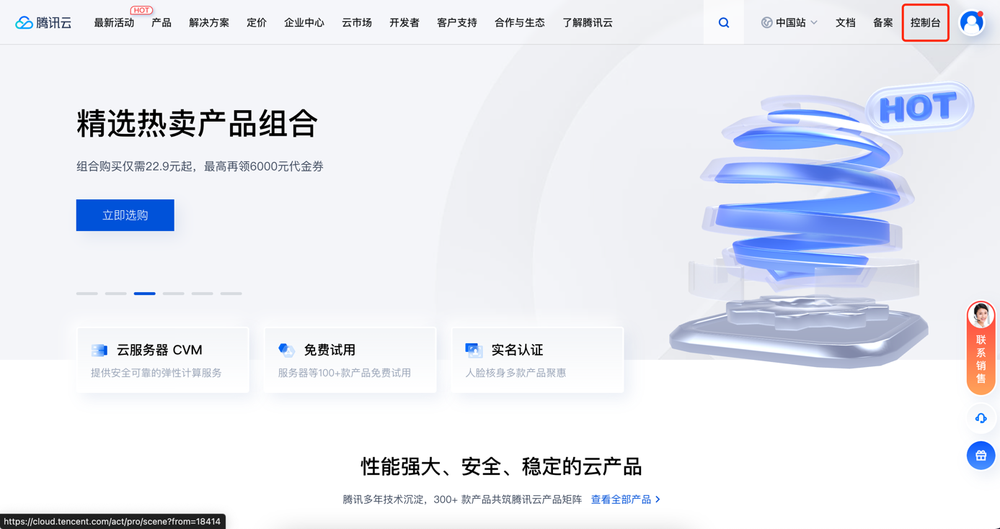

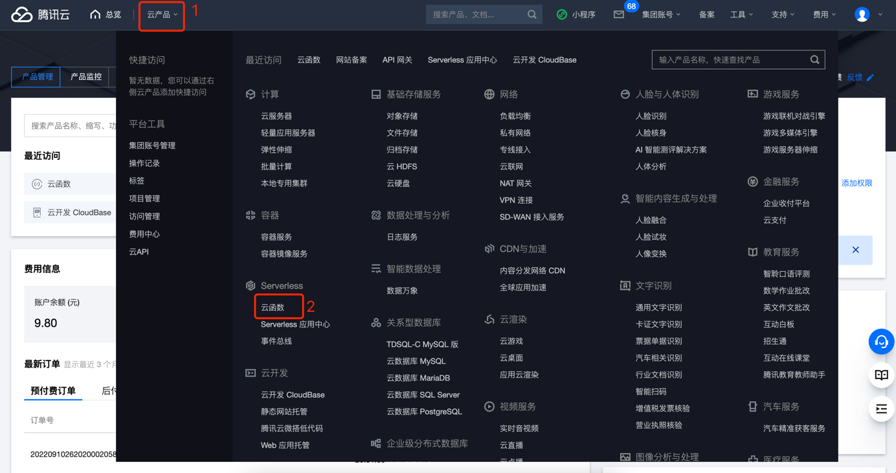

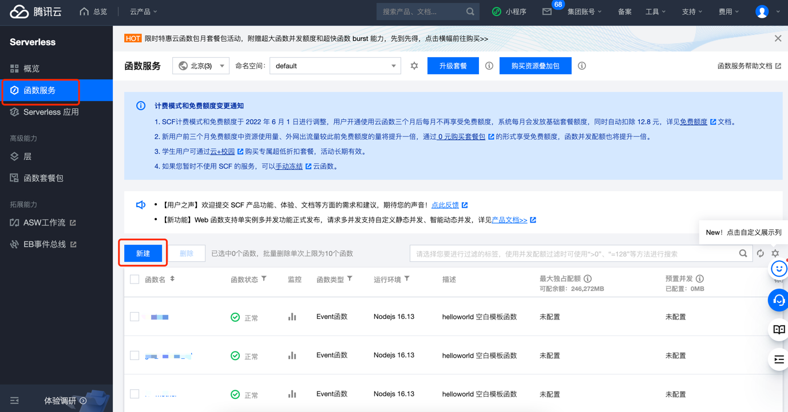

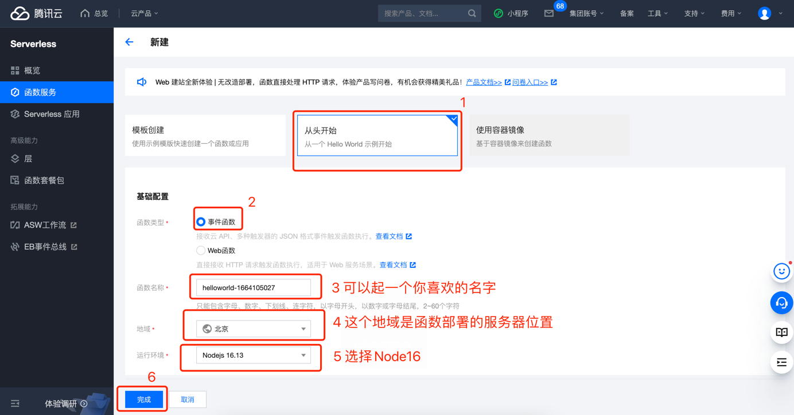

II. **编辑代码**
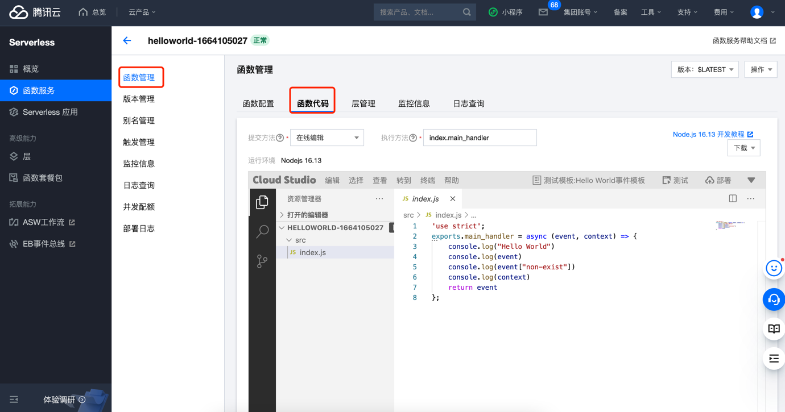

将编辑器中的代码替换为以下代码
```js
const main = require('./wechat-public-account-push/cloud')
exports.main_handler = async function () {
    await main()
}
```

如图所示

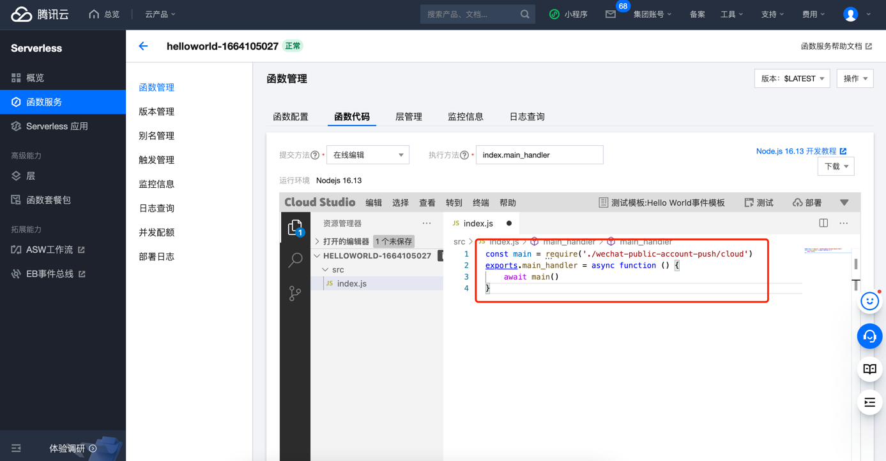

III. **克隆仓库代码**

使用编辑器终端进入`src`目录，克隆你的fork仓库

点击上方菜单 `终端` -> `新终端` 即可打开一个终端

输入
```shell
cd src
git clone <你的仓库地址>
```
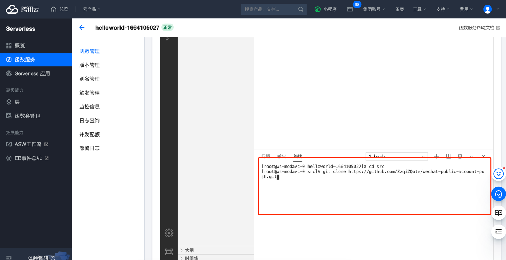

IV. **编辑config文件**

编辑仓库中的`config/index.cjs`文件，因为是在云函数上，因此APP_ID和APP_SECRET变量需要直接提供

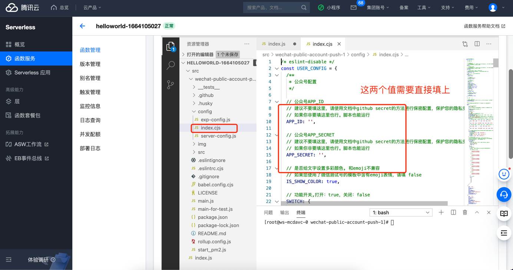

V. **编译云函数需要的代码**

在终端中使用`cd`进入项目仓库，并运行以下脚本
```shell
npm run build-cloud
```
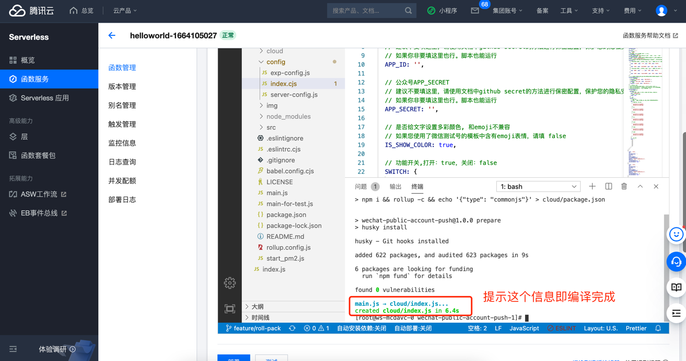

VI. **点击测试按钮进行测试**

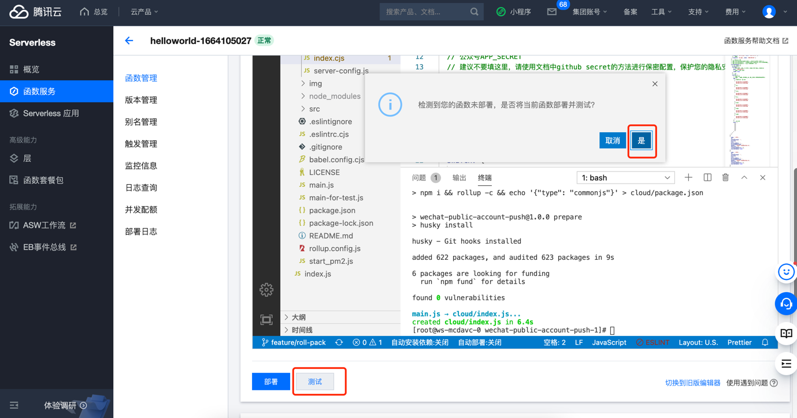

如果正常推送，即配置正确，进行最后一部设置定时触发器操作。

VII. **设置定时触发器**

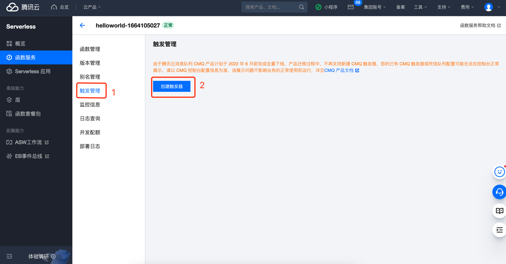

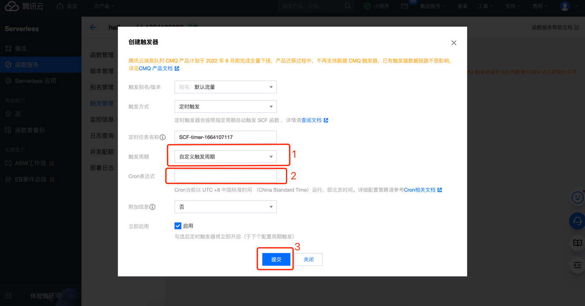

其中Cron表达式即为定时触发的时间，可以点击[https://crontab.guru](https://crontab.guru)帮助配置


[🪃返回首页 >>>](../README.md)
